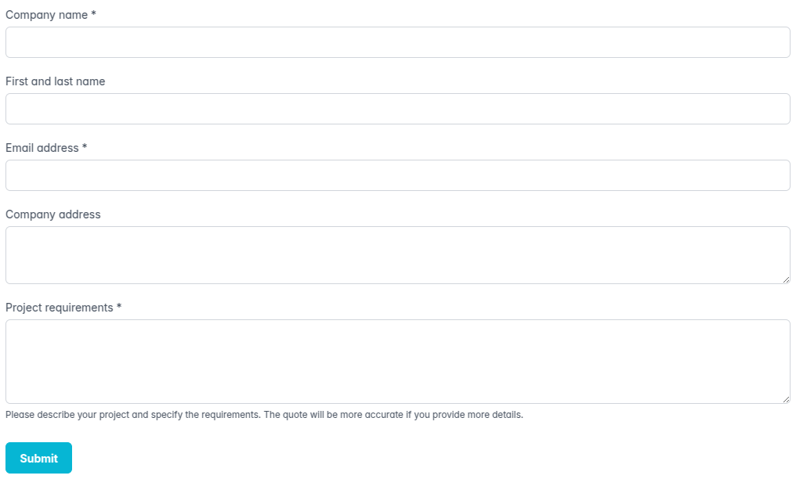

# Quote

In this tutorial, we'll look at a more realistic scenario for LetsFlow. In this scenario, a (potential) customer fills out a form, requesting a quote.

We'll focus on integration with an application; introducing the concept of services and notifications. We'll also look at custom action schemas and how this ties into building a frontend.


* Create file `quote.yaml` in `scenarios`.
* Create subdirectory `quote` in `features` for the test files.
* Create a directory `schemas` with subdirectories `actions` and `messages`.


## Customer request

The process starts with a customer filling out a form. The form has fields for customer info and project requirements.

### Test case

We'll create a test case where the customer fills out the form. For completeness, we also validate the case where the customer did not fill out all the required fields.


```gherkin
Feature: The customer fills out the form to request a quote

  Background:
    Given the process is created from the "quote" scenario
    And "Alice" is the "customer" actor
    And "Bob" is the "sales" actor

  Scenario: Customer fills out all fields correctly
    When "Alice" does "request" with:
      | company      | Acme Inc                                    |
      | contact      | Alice                                       |
      | email        | alice@example.com                           |
      | address      | 123 Main St                                 |
      | requirements | The product should be able to do X, Y and Z |
    Then the last event is not skipped
    And actor "customer" has "company" is "Acme Inc"
      * actor "customer" has "contact" is "Alice"
      * actor "customer" has "email" is "alice@example.com"
      * actor "customer" has "address" is "123 Main St"
    And the process is in "requested"

  Scenario: Customer does not fill out the email address and requirements
    When "Alice" does "request" with:
      | company | Acme Inc |
    Then the last event is skipped with "Response is invalid: data must have required property 'email'"
    Then the last event is skipped with "Response is invalid: data must have required property 'requirements'"
    And the process is in "initial"
```


### Scenario

The scenario has 2 actors; the sales department of our organisation and the customer. The initial action is for the customer to fill out the form.

The role of the sales actor is set to `sales`, so anyone on the sales team can respond as this actor.

The frontend will render a form for this action. That's done using [react-jsonschema-form](https://rjsf-team.github.io/react-jsonschema-form/docs/) for this example, which can render a form based on a JSON schema. It will use the `response` schema with additional render instructions defined in the `ui` property.

The update instructions will set the provided properties of the customer actor and will store the requirements as a variable.



```yaml
actors:
  sales:
    title: Organisation
    role: sales
    properties:
      name: !const 'Acme Inc.'
  customer:
    title: Customer
    properties:
      company: string
      address: string
      contact: string
      email: string

actions:
  request:
    schema: actions/form-v1
    actor: customer
    response:
      properties:
        company: !required
          title: Company name
          type: string
        contact:
          title: First and last name
          type: string
        email: !required
          title: Email address
          type: string
          format: email
        address:
          title: Company address
          type: string
        requirements: !required
          title: Project requirements
          description: >
            Please describe your project and specify the requirements.
            The quote will be more accurate if you provide more details.
          type: string
    ui:
      address:
        ui:widget: textarea
        ui:rows: 3
      requirements:
        ui:widget: textarea
        ui:rows: 5
    update:
      - set: actors.customer
        value: !ref "current.response | { company: company, address: address, contact: contact, email: email }"
        mode: merge
      - set: vars.requirements
        value: !ref current.response.requirements

states:
  initial:
    on: request
    goto: requested
  requested:
    on: next
    goto: (done)

vars:
  requirements: string

```



```json
{
  "actors": {
    "sales": {
      "title": "Organisation",
      "role": "sales",
      "properties": {
        "name": {
          "const": "Acme Inc."
        }
      }
    },
    "customer": {
      "title": "Customer",
      "properties": {
        "company": {
          "type": "string"
        },
        "address": {
          "type": "string"
        },
        "contact": {
          "type": "string"
        },
        "email": {
          "type": "string"
        }
      }
    }
  },
  "actions": {
    "request": {
      "schema": "actions/form-v1",
      "actor": "customer",
      "response": {
        "properties": {
          "company": {
            "title": "Company name",
            "type": "string"
          },
          "contact": {
            "title": "First and last name",
            "type": "string"
          },
          "email": {
            "title": "Email address",
            "type": "string",
            "format": "email"
          },
          "address": {
            "title": "Company address",
            "type": "string"
          },
          "requirements": {
            "title": "Project requirements",
            "description": "Please describe your project and specify the requirements. The quote will be more accurate if you provide more details.",
            "type": "string"
          }
        },
        "required": [
          "company",
          "email",
          "requirements"
        ]
      },
      "ui": {
        "address": {
          "ui:widget": "textarea",
          "ui:rows": 3
        },
        "requirements": {
          "ui:widget": "textarea",
          "ui:rows": 5
        }
      },
      "update": [
        {
          "mode": "merge",
          "set": "actors.customer",
          "value": {
            "<ref>": "current.response | { company: company, address: address, contact: contact, email: email }"
          }
        },
        {
          "mode": "set",
          "set": "vars.requirements",
          "value": {
            "<ref>": "current.response.requirements"
          }
        }
      ]
    }
  },
  "states": {
    "initial": {
      "on": "request",
      "goto": "requested"
    },
    "requested": {
      "on": "next",
      "goto": "(done)"
    }
  },
  "vars": {
    "requirements": {
      "type": "string"
    }
  }
}

```



### Form action

The `ui` property is not part of the LetsFlow JSON schema for a scenario; it is specific to your application.

To integrate LetsFlow into your backend and frontend, you should define schemas for actions, messages, and states. These schemas serve as identifiers for rendering actions or states in a specific way, enabling reusable components.

In this case, the component will use [react-jsonschema-form](https://rjsf-team.github.io/react-jsonschema-form/docs/) to render a form based on the `response` schema and `ui` object.

<figure><figcaption><p>Rendered form using react-jsonschema-form with the PrimeReact theme</p></figcaption></figure>


Visit the [LetsFlow React documentation](/broken/pages/Zg8IYiImlju3ziv7obbh) to learn how to build this component.


#### Sub schema validation

LetsFlow validation will apply the corresponding sub-schemas, ensuring that actions, states, and messages conform to the expected format of your application.




```yaml
$id: schema:actions/form-v1
description: Show a form using react-jsonschema-form for the user to fill out
additionalProperties: true
properties:
  response: !required
  ui:
    additionalProperties: object
```





```json
{
  "$id": "schema:actions/form-v1",
  "description": "Show a form using react-jsonschema-form for the user to fill out",
  "additionalProperties": true,
  "properties": {
    "ui": {
      "additionalProperties": "object"
    }
  },
  "required": [
    "response"
  ]
}
```





```json
{
  "$schema": "https://json-schema.org/draft/2020-12/schema",
  "$id": "schema:actions/form-v1",
  "description": "Show a form using react-jsonschema-form for the user to fill out",
  "type": "object",
  "additionalProperties": true,
  "properties": {
    "response": {},
    "ui": {
      "additionalProperties": {
        "type": "object"
      },
      "type": "object"
    }
  },
  "required": [
    "response"
  ]
}
```




The schema for requires the action to define a response schema. Optionally it can have a `ui` property, which should be a map of objects.

Always set `additionalProperties` to true for sub-schemas, so you don't need to define the standard properties that are already defined by the LetsFlow scenario schema.


The tutorial and demo uses `schema:` as URI scheme for the JSON schema id. The engine and test suite will load those schemas locally from the `schemas` folder. If you're using validation from the core library directly in your frontend you'll need to overwrite the `loadSchema` option of AJV.

Alternatively, you can publish the schemas online and use a full URL.


## Organization response

After the form has been submitted, the sales team should create a quote that can be sent to the customer.

### Test case

The requirements are shown as instructions to the sales team. The customer info is used to fill out part of the quote template. We're expecting a PDF as the response to this action.

After the quote is created, the _'email'_ service will send a message to the customer, with the quote in PDF format as an attachment.


```gherkin
Feature: The sales team creates a quote

  Background:
    Given the process is created from the "quote" scenario
    And "Alice" is the "customer" actor
    And "Bob" is the "sales" actor

    When "Alice" does "request" with:
      | company      | Acme Inc                                    |
      | contact      | Alice                                       |
      | email        | alice@example.com                           |
      | address      | 123 Main St                                 |
      | requirements | The product should be able to do X, Y and Z |
    Then the process is in "requested"

  Scenario: Sales creates a quote
    Then actor "customer" has instructions "Thank you for your request. We will get back to you shortly."
    And actor "sales" has instructions:
      """
      Please create a quote based on the customer requirements:
      The product should be able to do X, Y and Z
      """

    When "Bob" does "create_quote" with "cms:quotes/test.pdf"
    Then the last event is not skipped
    And the process is in "quoted"
    And the result is "cms:quotes/test.pdf"
```


### Scenario

The _'create\_quote'_ action asks for the sales department to draft a document based on the 'quote' template. The response should be a URI (a URL or other system-specific identifier) that allows the backend to fetch the file.

To generate an authentication token later on, we create a customer ID using the `uuid()` function of LetsFlow JMESPath. Note that all functions are deterministic. To create a unique identifier we take the (unique) process ID as the namespace and the actor key as input.



```yaml
actors:
  sales:
  customer:
    properties:
      company: string
      address: string
      contact: string
      email: string

actions:
  request:
    actor: customer
    update:
      - set: actors.customer
        value: !ref "current.response | { company: company, address: address, contact: contact, email: email }"
        mode: merge
      - set: vars.requirements
        value: !ref current.response.requirements
  create_quote:
    schema: actions/draft-v1
    actor: sales
    title: Create a quote
    description: Create a quote based on customer requirements
    template: quote
    data:
      customer: !ref actors.customer
    update: result

states:
  initial:
    on: request
    goto: requested
  requested:
    instructions:
      customer: !tpl |
        Thank you for your request. We will get back to you shortly.
      sales: !tpl |
        Please create a quote based on the customer requirements:
        {{ vars.requirements }}
    on: create_quote
    goto: quoted
  quoted:
    on: next
    goto: (done)

vars:
  requirements: string

result: !format uri
```



```json
{
  "actors": {
    "sales": {},
    "customer": {
      "properties": {
        "company": {
          "type": "string"
        },
        "address": {
          "type": "string"
        },
        "contact": {
          "type": "string"
        },
        "email": {
          "type": "string"
        }
      }
    }
  },
  "actions": {
    "request": {
      "actor": "customer",
      "update": [
        {
          "mode": "merge",
          "set": "actors.customer",
          "value": {
            "<ref>": "current.response | { company: company, address: address, contact: contact, email: email }"
          }
        },
        {
          "mode": "set",
          "set": "vars.requirements",
          "value": {
            "<ref>": "current.response.requirements"
          }
        }
      ]
    },
    "create_quote": {
      "schema": "actions/draft-v1",
      "actor": "sales",
      "title": "Create a quote",
      "description": "Create a quote based on customer requirements",
      "template": "quote",
      "data": {
        "customer": {
          "<ref>": "actors.customer"
        }
      },
      "update": "result"
    }
  },
  "states": {
    "initial": {
      "on": "request",
      "goto": "requested"
    },
    "requested": {
      "instructions": {
        "customer": {
          "<tpl>": "Thank you for your request. We will get back to you shortly."
        },
        "sales": {
          "<tpl>": "Please create a quote based on the customer requirements:\n{{ vars.requirements }}"
        }
      },
      "on": "create_quote",
      "goto": "quoted"
    },
    "quoted": {
      "on": "next",
      "goto": "(done)"
    }
  },
  "vars": {
    "requirements": {
      "type": "string"
    }
  },
  "result": {
    "type": "string",
    "format": "uri"
  }
}

```



### Draft action

The `create_quote` action expects to draft a new document based on a template. The action provides the template name and default data. This action is less abstract than the form action; it expects the application to know how to handle it.




```yaml
$id: schema:actions/draft-v1
description: |
  Create a document based on a template.
  This action can be automated through a document generation service or performed manually by an actor
additionalProperties: true
properties:
  template: !required string
  filetype: !default pdf
  data:
    description: |
      Data to be used to populate the template.
      When the action is performed by an actor, this is the default data.
    type: object
    additionalProperties: true

```





```json
{
  "$id": "schema:actions/draft-v1",
  "description": "Create a document based on a template.\nThis action can be automated through a document generation service or performed manually by an actor",
  "additionalProperties": true,
  "properties": {
    "template": {
      "type": "string"
    },
    "filetype": {
      "default": "pdf",
      "type": "string"
    },
    "data": {
      "description": "Data to be used to populate the template.\nWhen the action is performed by an actor, this is the default data.",
      "type": "object",
      "additionalProperties": true
    }
  },
  "required": ["template"]
}
```





```json
{
  "$schema": "https://json-schema.org/draft/2020-12/schema",
  "$id": "schema:actions/draft-v1",
  "description": "Create a document based on a template.\nThis action can be automated through a document generation service or performed manually by an actor",
  "type": "object",
  "additionalProperties": true,
  "properties": {
    "template": {
      "type": "string"
    },
    "filetype": {
      "type": "string",
      "default": "pdf"
    },
    "data": {
      "description": "Data to be used to populate the template.\nWhen the action is performed by an actor, this is the default data.",
      "type": "object",
      "additionalProperties": true
    }
  },
  "required": ["template"]
}

```





#### Do not use the scenario as code

We could have split up the `create_draft` step into multiple abstract steps:

* fill out a form for the quote information
* fetch a template from the database and store it in a process variable
* use mustache to fill out the template and create the quote document
* use a service to create a PDF from the quote document

More abstract action types look attractive since you can create different scenarios without writing code. In reality, you're still writing code but now in YAML.

Solving edge cases and error handling, which is normally handled by your application, now need to be part of the scenario. This will make the workflows large, complex, and hard to maintain.

Additionally, it exposes the inner logic of a process, making it more likely that a modification to a service will break scenarios and running processes.

**When in doubt; choose more specific over more abstract action definitions.**


## Sending an email

When the sales team uploads a quote, it should be emailed to the customer. For this, we trigger an external service, which can be a microservice or part of your backend.

The email service fills out a template with the provided data from the process to create a customized email. The quote PDF is added as an attachement.


In the [backend documentation](/broken/pages/JAU5GrDJrD1BNFWJ6iEp), you'll learn how to create the `email` service.


### Test case

The email service fills out an email template and sends it to the recipient. It expects a specific message when triggered. In this case, it uses the `quote` template with the customer info and cancellation reason as data.


```gherkin
Feature: The sales team sends a quote

  Background:
    Given the process is created from the "quote" scenario
    And "Alice" is the "customer" actor
    And "Bob" is the "sales" actor

    When "Alice" does "request" with:
      | company      | Acme Inc                                    |
      | contact      | Alice                                       |
      | email        | alice@example.com                           |
      | address      | 123 Main St                                 |
      | requirements | The product should be able to do X, Y and Z |
    Then the process is in "requested"

  Scenario: Sales creates a quote
    When "Bob" does "create_quote" with "cms:quotes/test.pdf"
    Then the last event is not skipped
    And the process is in "quoted"
    And the result is "cms:quotes/test.pdf"
    And service "email" is notified with:
      """yaml
        schema: messages/email-v1
        to:
          name: Alice
          email: alice@example.com
        template: quote
        data:
          customer:
            title: Customer
            id: !ref actors.customer.id
            company: Acme Inc
            contact: Alice
            email: alice@example.com
            address: 123 Main St
        generate_token: !ref actors.customer.id
        attachments:
          - filename: quote.pdf
            source: cms:quotes/test.pdf
      """

```


### Scenario

In order to generate an authentication token by the email service, we create a customer ID using the `uuid()` function of LetsFlow JMESPath. Note that all JMESPath functions are deterministic. To create a unique identifier we take the (unique) process ID as the namespace and the actor key as input.


For this tutorial, the customer information is stored in the process. For a real application, you might store it in a CRM instead. In that case, only specify the client ID as data and let the _'email'_ service fetch it. This ensures that modifications of the customer information in the CRM will apply to the process.




```yaml
actors:
  sales:
  customer:
    properties:
      company: string
      address: string
      contact: string
      email: string

actions:
  request:
    actor: customer
    update:
      - set: actors.customer
        value: !ref "current.response | { id: uuid('customer', $.id), company: company, address: address, contact: contact, email: email }"
        mode: merge
      - set: vars.requirements
        value: !ref current.response.requirements
  create_quote:
    schema: actions/draft-v1
    actor: sales
    update: result

states:
  initial:
    on: request
    goto: requested
  requested:
    on: create_quote
    goto: quoted
  quoted:
    notify:
      service: email
      message:
        schema: messages/email-v1
        to: !ref 'actors.customer | { name: contact, email: email }'
        template: quote
        generate_token: !ref actors.customer.id
        data:
          customer: !ref actors.customer
        attachments:
          - filename: quote.pdf
            source: !ref result  
    on: next
    goto: (done)

vars:
  requirements: string

result: !format uri
```



```json
{
  "actors": {
    "sales": {},
    "customer": {
      "properties": {
        "company": {
          "type": "string"
        },
        "address": {
          "type": "string"
        },
        "contact": {
          "type": "string"
        },
        "email": {
          "type": "string"
        }
      }
    }
  },
  "actions": {
    "request": {
      "actor": "customer",
      "update": [
        {
          "mode": "merge",
          "set": "actors.customer",
          "value": {
            "<ref>": "current.response | { id: uuid('customer', $.id), company: company, address: address, contact: contact, email: email }"
          }
        },
        {
          "mode": "set",
          "set": "vars.requirements",
          "value": {
            "<ref>": "current.response.requirements"
          }
        }
      ]
    },
    "create_quote": {
      "schema": "actions/draft-v1",
      "actor": "sales",
      "update": "result"
    }
  },
  "states": {
    "initial": {
      "on": "request",
      "goto": "requested"
    },
    "requested": {
      "on": "create_quote",
      "goto": "quoted"
    },
    "quoted": {
      "notify": {
        "service": "email",
        "message": {
          "schema": "messages/email-v1",
          "to": {
            "<ref>": "actors.customer | { name: contact, email: email }"
          },
          "template": "quote",
          "generate_token": {
            "<ref>": "actors.customer.id"
          },
          "data": {
            "customer": {
              "<ref>": "actors.customer"
            }
          },
          "attachments": [
            {
              "filename": "quote.pdf",
              "source": {
                "<ref>": "result"
              }
            }
          ]
        }
      },
      "on": "next",
      "goto": "(done)"
    }
  },
  "vars": {
    "requirements": {
      "type": "string"
    }
  },
  "result": {
    "type": "string",
    "format": "uri"
  }
}

```



### Email service

The message format is defined as a schema. Similar to a schema of an action, sub-schema validation of notification messages is applied when the scenario is validated.




```yaml
$id: schema:messages/email-v1
description: Send an email based on a template using the email service
additionalProperties: true
properties:
  to: !required
    oneOf:
      - !format email
      - properties:
          name: string
          email: !format email
        required: [email]
  template: !required string
  generate_token: string
  data:
    type: object
    additionalProperties: true
  attachments:
    items:
      properties:
        filename: string
        source: !required string

```





```json
{
  "$id": "schema:messages/email-v1",
  "description": "Send an email based on a template using the email service",
  "additionalProperties": true,
  "properties": {
    "to": {
      "oneOf": [
        {
          "type": "string",
          "format": "email"
        },
        {
          "type": "object",
          "properties": {
            "name": {
              "type": "string"
            },
            "email": {
              "type": "string",
              "format": "email"
            }
          },
          "required": ["email"]
        }
      ]
    },
    "template": {
      "type": "string"
    },
    "generate_token": {
      "type": "string"
    },
    "data": {
      "type": "object",
      "additionalProperties": true
    },
    "attachments": {
      "type": "array",
      "items": {
        "type": "object",
        "properties": {
          "filename": {
            "type": "string"
          },
          "source": {
            "type": "string"
          }
        },
        "required": ["source"]
      }
    }
  },
  "required": ["to", "template"]
}

```





```json
{
  "$schema": "https://json-schema.org/draft/2020-12/schema",
  "$id": "schema:messages/email-v1",
  "description": "Send an email based on a template using the email service",
  "type": "object",
  "additionalProperties": true,
  "properties": {
    "to": {
      "oneOf": [
        {
          "type": "string",
          "format": "email"
        },
        {
          "type": "object",
          "properties": {
            "name": {
              "type": "string"
            },
            "email": {
              "type": "string",
              "format": "email"
            }
          },
          "required": ["email"],
          "additionalProperties": false
        }
      ]
    },
    "template": {
      "type": "string"
    },
    "data": {
      "type": "object",
      "additionalProperties": true
    }
  },
  "required": [
    "to",
    "template"
  ]
}

```




## Acceptance

After the sales team has sent the quote, the customer has the option to accept or reject the quote. The email will contain a link to a page where the customer can select to accept or reject.

### Test case

If the customer accepts the quote, the process will end in the `(accepted)` end state. The sales team will handle it further, which is outside the scope of this scenario.

When rejected, the customer should specify a reason. If the customer doesn't respond within 10 days, the quote is automatically rejected.


```gherkin
Feature: The customer accepts or rejects the quote

  Background:
    Given the process is created from the "quote" scenario
    And "Alice" is the "customer" actor
    And "Bob" is the "sales" actor

    When "Alice" does "request" with:
      | company      | Acme Inc                                    |
      | contact      | Alice                                       |
      | email        | alice@example.com                           |
      | address      | 123 Main St                                 |
      | requirements | The product should be able to do X, Y and Z |
    Then the process is in "requested"

    When "Bob" does "create_quote" with "cms:quotes/test.pdf"
    Then the process is in "quoted"

  Scenario: Customer accepts the quote
    When "Alice" does "accept"
    Then the last event is not skipped
    And the process ended in "accepted"

  Scenario: Customer rejects the quote
    When "Alice" does "reject" with:
      | reason | Too expensive |
    Then the last event is not skipped
    And the process ended in "rejected"
    And the state description is:
      """
      The quote has been rejected.
      Reason: Too expensive
      """

  Scenario: Customer doesn't respond
    When 10 days pass
    Then the last event is a timeout
    Then the process ended in "rejected"
    And the state description is "The customer has not responded to the quote."
```


### Scenario

Instead of `on` we can use `after` to automatically trigger an event after a certain time has passed. In this case, after 10 days the proposal is automatically rejected.

The `<select>` data function can be used to select one of the options based on a boolean, numeric or string value. We use that to select the description of the `(rejected)` state.



```yaml
actors:
  sales:
  customer:
    properties:
      id: !format uuid
      company: string
      address: string
      contact: string
      email: string

actions:
  request:
    actor: customer
    update:
      - set: actors.customer
        value: !ref "current.response | { id: uuid('customer', $.id), company: company, address: address, contact: contact, email: email }"
        mode: merge
      - set: vars.requirements
        value: !ref current.response.requirements
  create_quote:
    actor: sales
    update: result
  reject:
    schema: actions/form-v1
    title: Reject
    description: Reject the quote request
    response:
      properties:
        reason: !required string
    ui:
      reason:
        ui:widget: textarea
        ui:rows: 3
    update:
      - set: vars.reason
        value: !ref current.response.reason
states:
  initial:
    on: request
    goto: requested
  requested:
    on: create_quote
    goto: quoted
  quoted:
    transitions:
      - on: accept
        goto: (accepted)
      - on: reject
        goto: (rejected)
      - after: 10 days
        goto: (rejected)
  (rejected):
    description: !select
      $: !ref vars.reason == null
      true: The customer has not responded to the quote.
      false: !tpl |
        The quote has been rejected.
        Reason: {{ vars.reason }}

vars:
  requirements: string
  reason: string

result: !format uri
```



```json
{
  "actors": {
    "sales": {},
    "customer": {
      "properties": {
        "id": {
          "type": "string",
          "format": "uuid"
        },
        "company": {
          "type": "string"
        },
        "address": {
          "type": "string"
        },
        "contact": {
          "type": "string"
        },
        "email": {
          "type": "string"
        }
      }
    }
  },
  "actions": {
    "request": {
      "actor": "customer",
      "update": [
        {
          "mode": "merge",
          "set": "actors.customer",
          "value": {
            "<ref>": "current.response | { id: uuid('customer', $.id), company: company, address: address, contact: contact, email: email }"
          }
        },
        {
          "mode": "set",
          "set": "vars.requirements",
          "value": {
            "<ref>": "current.response.requirements"
          }
        }
      ]
    },
    "create_quote": {
      "actor": "sales",
      "update": "result"
    },
    "reject": {
      "schema": "actions/form-v1",
      "title": "Reject",
      "description": "Reject the quote request",
      "response": {
        "properties": {
          "reason": {
            "type": "string"
          }
        },
        "required": [
          "reason"
        ]
      },
      "ui": {
        "reason": {
          "ui:widget": "textarea",
          "ui:rows": 3
        }
      },
      "update": [
        {
          "mode": "set",
          "set": "vars.reason",
          "value": {
            "<ref>": "current.response.reason"
          }
        }
      ]
    }
  },
  "states": {
    "initial": {
      "on": "request",
      "goto": "requested"
    },
    "requested": {
      "transitions": [
        {
          "on": "create_quote",
          "goto": "quoted"
        },
        {
          "on": "cancel",
          "goto": "(cancelled)"
        }
      ]
    },
    "quoted": {
      "transitions": [
        {
          "on": "accept",
          "goto": "(accepted)"
        },
        {
          "on": "reject",
          "goto": "(rejected)"
        },
        {
          "after": "10 days",
          "goto": "(rejected)"
        }
      ]
    },
    "(rejected)": {
      "description": {
        "<select>": {
          "$": {
            "<ref>": "vars.reason == null"
          },
          "true": "The customer has not responded to the quote.",
          "false": {
            "<tpl>": "The quote has been rejected.\nReason: {{ vars.reason }}"
          }
        }
      }
    }
  },
  "vars": {
    "requirements": {
      "type": "string"
    },
    "reason": {
      "type": "string"
    }
  },
  "result": {
    "type": "string",
    "format": "uri"
  }
}
```



## Cancellation

The scenario above describes the golden flow; the optimal path to reach the objective. However, alternative paths can exist; for instance, the sales team or the customer can cancel the request.&#x20;

The sales team might cancel if the company can't meet the requirements. The customer might cancel if it no longer needs the requested product or service.

We want the actor who cancels the process to specify a reason, which is displayed to all participants.

### Test case

In case the sales department cancels, the customer should receive an email with the cancellation reason. If the customer cancels, no email should be sent.


```gherkin
Feature: The sales team or customer cancels

  Background:
    Given the process is created from the "quote" scenario
    And "Alice" is the "customer" actor
    And "Bob" is the "sales" actor

    When "Alice" does "request" with:
      | company      | Acme Inc                                    |
      | contact      | Alice                                       |
      | email        | alice@example.com                           |
      | address      | 123 Main St                                 |
      | requirements | The product should be able to do X, Y and Z |
    Then the process is in "requested"

  Scenario: Sales cancels the process
    When "Bob" does "cancel" with:
      | reason | Unable to deliver on requirements |
    Then the last event is not skipped
    And the process ended in "cancelled"
    And the state description is:
      """
      The quote request has been cancelled.
      Reason: Unable to deliver on requirements
      """
    And service "email" is notified with:
      """yaml
        schema: messages/email-v1
        to:
          name: Alice
          email: alice@example.com
        template: quote-cancelled
        data:
          customer:
            title: Customer
            id: !ref actors.customer.id
            company: Acme Inc
            contact: Alice
            email: alice@example.com
            address: 123 Main St
          reason: Unable to deliver on requirements
      """

  Scenario: Customer cancels the process
    When "Alice" does "cancel" with:
      | reason | No longer interested |
    Then the last event is not skipped
    And the process ended in "cancelled"
    And the state description is:
      """
      The quote request has been cancelled.
      Reason: No longer interested
      """
    And service "email" is not notified
```


### Scenario

For the `cancel` action, we'll reuse the `form` action schema. The form contains a single field that allows the participant to specify the reason for cancellation. The reason is set as process variable and is used in the email to the client and shown to all participants.

We explicitly define the end-state `cancelled`, so we can specify a description and notify instructions. If the sales team cancels the process, the email service is notified to send an email to the customer.



```yaml
actors:
  sales:
  customer:
    properties:
      id: !format uuid
      company: string
      address: string
      contact: string
      email: string

actions:
  request:
    actor: customer
    update:
      - set: actors.customer
        value: !ref "current.response | { id: uuid('customer', $.id), company: company, address: address, contact: contact, email: email }"
        mode: merge
      - set: vars.requirements
        value: !ref current.response.requirements
  create_quote:
    actor: sales
    update: result
  reject: &reject_action
    schema: actions/form-v1
    title: Reject
    description: Reject the quote request
    response:
      properties:
        reason: !required string
    ui:
      reason:
        ui:widget: textarea
        ui:rows: 3
    update:
      - set: vars.reason
        value: !ref current.response.reason
  cancel:
    <<: *reject_action
    title: Cancel
    description: Cancel the quote request

states:
  initial:
    on: request
    goto: requested
  requested:
    transitions:
      - on: create_quote
        goto: quoted
      - on: cancel
        goto: (cancelled)
  quoted:
    on: next
    goto: (done)
  (cancelled):
    description: !tpl |
      The quote request has been cancelled.
      Reason: {{ vars.reason }}
    notify:
      service: email
      if: !ref previous[-1].actor.key == 'sales'
      message:
        schema: messages/email-v1
        to: !ref 'actors.customer | { name: contact, email: email }'
        template: quote-cancelled
        data:
          customer: !ref actors.customer
          reason: !ref vars.reason

vars:
  requirements: string
  reason: string

result: !format uri

```


The `cancel` action is similar to `reject`. With YAML we can create an anchor `reject_action` and reference it in the `cancel` action with a [`<<` merge operation](https://yaml.org/type/merge.html).




```json
{
  "name": "quote",
  "version": "1.0",
  "title": "Quote",
  "description": "Send a quote based on customer requirements",
  "actors": {
    "sales": {
      "title": "Organisation",
      "role": "sales",
      "properties": {
        "name": {
          "const": "Acme Inc."
        }
      }
    },
    "customer": {
      "title": "Customer",
      "properties": {
        "id": {
          "type": "string",
          "format": "uuid"
        },
        "company": {
          "type": "string"
        },
        "address": {
          "type": "string"
        },
        "contact": {
          "type": "string"
        },
        "email": {
          "type": "string"
        }
      }
    }
  },
  "actions": {
    "request": {
      "actor": "customer",
      "update": [
        {
          "set": "actors.customer",
          "value": {
            "<ref>": "current.response | { id: uuid('customer', $.id), company: company, address: address, contact: contact, email: email }"
          },
          "mode": "merge"
        },
        {
          "set": "vars.requirements",
          "value": {
            "<ref>": "current.response.requirements"
          }
        }
      ]
    },
    "create_quote": {
      "actor": "sales",
      "update": "result"
    },
    "cancel": {
      "schema": "actions/form-v1",
      "title": "Cancel",
      "description": "Cancel the quote request",
      "response": {
        "properties": {
          "reason": {
            "type": "string",
            "!required": true
          }
        }
      },
      "ui": {
        "reason": {
          "ui:widget": "textarea",
          "ui:rows": 3
        }
      },
      "update": {
        "set": "vars.reason",
        "value": {
          "<ref>": "current.response.reason"
        }
      }
    }
  },
  "states": {
    "initial": {
      "on": "request",
      "goto": "requested"
    },
    "requested": {
      "instructions": {
        "customer": {
          "<tpl>": "Thank you for your request. We will get back to you shortly."
        },
        "sales": {
          "<tpl>": "Please create a quote based on the customer requirements:\n{{ vars.requirements }}"
        }
      },
      "transitions": [
        {
          "on": "create_quote",
          "goto": "quoted"
        },
        {
          "on": "cancel",
          "goto": "(cancelled)"
        }
      ]
    },
    "quoted": {
      "on": "next",
      "goto": "(done)"
    },
    "(cancelled)": {
      "description": {
        "<tpl>": "The quote request has been cancelled.\nReason: {{ vars.reason }}"
      },
      "notify": {
        "service": "email",
        "if": {
          "<ref>": "previous[-1].actor.key == 'sales'"
        },
        "message": {
          "schema": "messages/email-v1",
          "to": {
            "<ref>": "actors.customer | { name: contact, email: email }"
          },
          "template": "quote-cancelled",
          "data": {
            "customer": {
              "<ref>": "actors.customer"
            },
            "reason": {
              "<ref>": "vars.reason"
            }
          }
        }
      }
    }
  },
  "vars": {
    "requirements": {
      "type": "string"
    },
    "reason": {
      "type": "string"
    }
  },
  "result": {
    "type": "string",
    "format": "uri"
  }
}

```



## Conclusion

Here is the full scenario with all of the steps combined.



```yaml
name: quote
version: '1.0'
title: Quote
description: Send a quote based on customer requirements

actors:
  sales:
    title: Organisation
    role: sales
    properties:
      name: !default 'Acme Inc.'
  customer:
    title: Customer
    properties:
      id: !format uuid
      company: string
      address: string
      contact: string
      email: string

actions:
  request:
    schema: actions/form-v1
    actor: customer
    response:
      properties:
        company: !required
          title: Company name
          type: string
        contact:
          title: First and last name
          type: string
        email: !required
          title: Email address
          type: string
          format: email
        address:
          title: Company address
          type: string
        requirements: !required
          title: Project requirements
          description: >
            Please describe your project and specify the requirements.
            The quote will be more accurate if you provide more details.
          type: string
    ui:
      address:
        ui:widget: textarea
        ui:rows: 3
      requirements:
        ui:widget: textarea
        ui:rows: 5
    update:
      - set: actors.customer
        value: !ref "current.response | { id: uuid('customer', $.id), company: company, address: address, contact: contact, email: email }"
        mode: merge
      - set: vars.requirements
        value: !ref current.response.requirements
  create_quote:
    schema: actions/draft-v1
    actor: sales
    title: Create a quote
    description: Create a quote based on customer requirements
    template: quote
    data:
      customer: !ref actors.customer
    update: result
  reject: &reject_action
    schema: actions/form-v1
    title: Reject
    description: Reject the quote request
    response:
      properties:
        reason: !required string
    ui:
      reason:
        ui:widget: textarea
        ui:rows: 3
    update:
      - set: vars.reason
        value: !ref current.response.reason
  cancel:
    <<: *reject_action
    title: Cancel
    description: Cancel the quote request

states:
  initial:
    on: request
    goto: requested
  requested:
    instructions:
      customer: !tpl |
        Thank you for your request. We will get back to you shortly.
      sales: !tpl |
        Please create a quote based on the customer requirements:
        {{ vars.requirements }}
    transitions:
      - on: create_quote
        goto: quoted
      - on: cancel
        goto: (cancelled)
  quoted:
    notify:
      service: email
      message:
        schema: messages/email-v1
        to: !ref 'actors.customer | { name: contact, email: email }'
        template: quote
        generate_token: !ref actors.customer.id
        data:
          customer: !ref actors.customer
        attachments:
          - filename: quote.pdf
            source: !ref result
    transitions:
      - on: accept
        goto: (accepted)
      - on: reject
        goto: (rejected)
      - after: 10 days
        goto: (rejected)
  (cancelled):
    description: !tpl |
      The quote request has been cancelled.
      Reason: {{ vars.reason }}
    notify:
      service: email
      if: !ref previous[-1].actor.key == 'sales'
      message:
        schema: messages/email-v1
        to: !ref 'actors.customer | { name: contact, email: email }'
        template: no-quote
        data:
          customer: !ref actors.customer
          reason: !ref vars.reason
  (rejected):
    description: !select
      $: !ref vars.reason == null
      true: The customer has not responded to the quote.
      false: !tpl |
        The quote has been rejected.
        Reason: {{ vars.reason }}

vars:
  requirements: string
  reason: string

result: !format uri
```



```json
{
  "name": "quote",
  "version": "1.0",
  "title": "Quote",
  "description": "Send a quote based on customer requirements",
  "actors": {
    "sales": {
      "title": "Organisation",
      "role": "sales",
      "properties": {
        "name": {
          "default": "Acme Inc.",
          "type": "string"
        }
      }
    },
    "customer": {
      "title": "Customer",
      "properties": {
        "id": {
          "type": "string",
          "format": "uuid"
        },
        "company": {
          "type": "string"
        },
        "address": {
          "type": "string"
        },
        "contact": {
          "type": "string"
        },
        "email": {
          "type": "string"
        }
      }
    }
  },
  "actions": {
    "request": {
      "schema": "actions/form-v1",
      "actor": "customer",
      "response": {
        "properties": {
          "company": {
            "title": "Company name",
            "type": "string"
          },
          "contact": {
            "title": "First and last name",
            "type": "string"
          },
          "email": {
            "title": "Email address",
            "type": "string",
            "format": "email"
          },
          "address": {
            "title": "Company address",
            "type": "string"
          },
          "requirements": {
            "title": "Project requirements",
            "description": "Please describe your project and specify the requirements. The quote will be more accurate if you provide more details.",
            "type": "string"
          }
        },
        "required": [
          "company",
          "email",
          "requirements"
        ]
      },
      "ui": {
        "address": {
          "ui:widget": "textarea",
          "ui:rows": 3
        },
        "requirements": {
          "ui:widget": "textarea",
          "ui:rows": 5
        }
      },
      "update": [
        {
          "mode": "merge",
          "set": "actors.customer",
          "value": {
            "<ref>": "current.response | { id: uuid('customer', $.id), company: company, address: address, contact: contact, email: email }"
          }
        },
        {
          "mode": "merge",
          "set": "vars.requirements",
          "value": {
            "<ref>": "current.response.requirements"
          }
        }
      ]
    },
    "create_quote": {
      "schema": "actions/draft-v1",
      "actor": "sales",
      "title": "Create a quote",
      "description": "Create a quote based on customer requirements",
      "template": "quote",
      "data": {
        "customer": {
          "<ref>": "actors.customer"
        }
      },
      "update": "result"
    },
    "reject": {
      "schema": "actions/form-v1",
      "title": "Reject",
      "description": "Reject the quote request",
      "response": {
        "properties": {
          "reason": {
            "type": "string"
          }
        },
        "required": [
          "reason"
        ]
      },
      "ui": {
        "reason": {
          "ui:widget": "textarea",
          "ui:rows": 3
        }
      },
      "update": [
        {
          "mode": "merge",
          "set": "vars.reason",
          "value": {
            "<ref>": "current.response.reason"
          }
        }
      ]
    },
    "cancel": {
      "schema": "actions/form-v1",
      "title": "Cancel",
      "description": "Cancel the quote request",
      "response": {
        "properties": {
          "reason": {
            "type": "string"
          }
        },
        "required": [
          "reason"
        ]
      },
      "ui": {
        "reason": {
          "ui:widget": "textarea",
          "ui:rows": 3
        }
      },
      "update": [
        {
          "mode": "merge",
          "set": "vars.reason",
          "value": {
            "<ref>": "current.response.reason"
          }
        }
      ]
    }
  },
  "states": {
    "initial": {
      "on": "request",
      "goto": "requested"
    },
    "requested": {
      "instructions": {
        "customer": {
          "<tpl>": "Thank you for your request. We will get back to you shortly."
        },
        "sales": {
          "<tpl>": "Please create a quote based on the customer requirements:\n{{ vars.requirements }}"
        }
      },
      "transitions": [
        {
          "on": "create_quote",
          "goto": "quoted"
        },
        {
          "on": "cancel",
          "goto": "(cancelled)"
        }
      ]
    },
    "quoted": {
      "notify": {
        "service": "email",
        "message": {
          "schema": "messages/email-v1",
          "to": {
            "<ref>": "actors.customer | { name: contact, email: email }"
          },
          "template": "quote",
          "generate_token": {
            "<ref>": "actors.customer.id"
          },
          "data": {
            "customer": {
              "<ref>": "actors.customer"
            }
          },
          "attachments": [
            {
              "filename": "quote.pdf",
              "source": {
                "<ref>": "result"
              }
            }
          ]
        }
      },
      "transitions": [
        {
          "on": "accept",
          "goto": "(accepted)"
        },
        {
          "on": "reject",
          "goto": "(rejected)"
        },
        {
          "after": "10 days",
          "goto": "(rejected)"
        }
      ]
    },
    "(cancelled)": {
      "description": {
        "<tpl>": "The quote request has been cancelled.\nReason: {{ vars.reason }}"
      },
      "notify": {
        "service": "email",
        "if": {
          "<ref>": "previous[-1].actor.key == 'sales'"
        },
        "message": {
          "schema": "messages/email-v1",
          "to": {
            "<ref>": "actors.customer | { name: contact, email: email }"
          },
          "template": "no-quote",
          "data": {
            "customer": {
              "<ref>": "actors.customer"
            },
            "reason": {
              "<ref>": "vars.reason"
            }
          }
        }
      }
    },
    "(rejected)": {
      "description": {
        "<select>": {
          "$": {
            "<ref>": "vars.reason == null"
          },
          "true": "The customer has not responded to the quote.",
          "false": {
            "<tpl>": "The quote has been rejected.\nReason: {{ vars.reason }}"
          }
        }
      }
    }
  },
  "vars": {
    "requirements": {
      "type": "string"
    },
    "reason": {
      "type": "string"
    }
  },
  "result": {
    "type": "string",
    "format": "uri"
  }
}

```



### Congratulations!

You've completed the tutorial. For more examples please check out the [Cookbook](/broken/pages/X8oRTAzVZ7hW9KurCw06).
